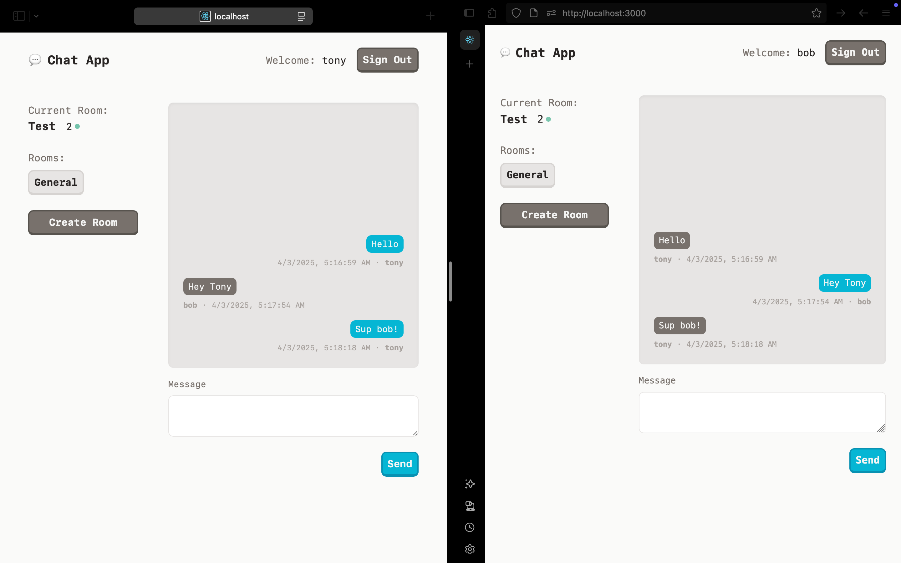

# Chat App

## Client - Front End (React)
### Launch Project
1. Run `npm i`
2. Run `npm run start`

## Server - Backend (Express)
### Launch Project **(in new terminal)**
1. Run `npm i`
2. Run `npm run start`

## Code Checkpoints
- 90 min mark: https://github.com/keisto/chat-app/tree/f30a5f13c3ec0ed496af9b53d99dc7c70bb4bd37
  - Server has socket.io installed client doesn't yet
  - Video walk through:
  <video width="320" height="240" controls>
    <source src="https://youtu.be/Qv3pDtDlV2U" type="video/mp4">
  </video>

- 120 min mark: https://github.com/keisto/chat-app/tree/2f5708385a7d8ab5ff351c160f0a253b78747bcd
  - Added client has socket.io set up, messages work, no ability to change/create rooms
- ~3 hours - Final: https://github.com/keisto/chat-app
  - Still room for improvement:
  

## Next Steps

1. Protect socket events with authorization
2. Add errors messages and form validation
3. Clean up spaghetti code
4. Clean up server extract helpers and socket.io into its own file to clean up server file
